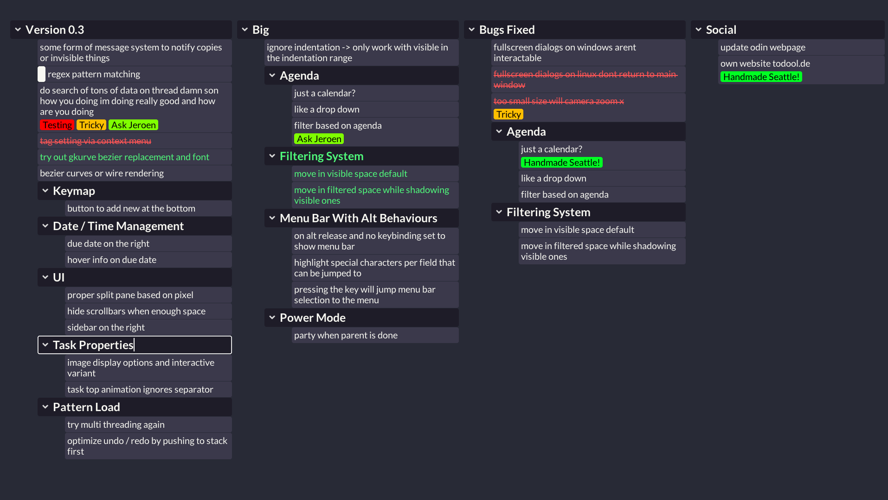

# Todool

I developed [Todool](https://todool.de/) fulltime from 2022-2023 in [odin](https://odin-lang.org/). I started selling it in November 2022 but quickly felt a bit of burnout. Lot's of reworks lead to the current state of things, which I feel like reworking again... 

Instead of letting the project die completly I'll share the source here, have fun with it!

## What I'd rework

- Renderer: compute tiled sdf renderer to save up on rerendering
- UI: immediate style to be more detatched from the data
- DB: store the editor content in a database and write out a readable text file that ppl can have as a backup or git inspection
- Kanban: remove kanban and focus solely on "List Mode" and make that better

## Tech

- OpenGL 3.3 renderer similar to 4coder
- SDL2
- fontstash - glyph atlas [fontstash](https://github.com/memononen/fontstash)
- RMGUI - similar to [luigi](https://github.com/nakst/luigi/blob/main/luigi.h)
- Undo/Redo with callbacks (not that nice)
- Custom binary file format (trash)

## How To Build

Install [Odin](https://odin-lang.org/docs/install/) based on your platform.

### Prepare Static Libraries (Linux/Darwin)

1. Build stb truetype -> go to `odin/vendor/stb/src/` and run `make` in there
2. Build -> go to `src/tfd` and run `make` in there

### Todool

1. Clone this repository.
2. Create a `target` folder next to the `src` folder
3. On Windows: run `build.bat` - On Linux/Darwin: run `make`
